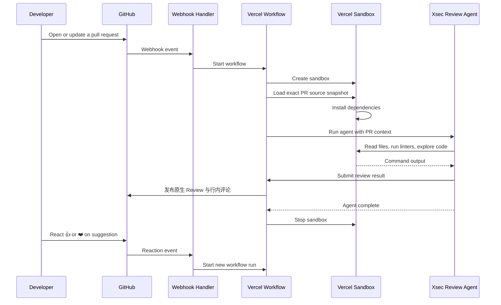

# Xsec Review

面向 GitHub 拉取请求的自动化代码审计服务。Xsec Review 在 PR 创建、更新和人工触发时读取完整变更，并发布中文的原生 GitHub Review 与行内评论。


## Features

- **Automatic reviews** — PR 创建、重新打开、转为 Ready 或更新时自动审计
- **Visible review status** — 审计开始时发布状态评论并添加 👀；结束时更新状态，干净结果添加 👍
- **Inline findings** — 原生 GitHub Review 一次提交汇总和可精确定位的行内评论
- **On-demand follow-ups** — 在 PR 评论中提及已安装的 GitHub App 以请求额外检查。由 [Chat SDK](https://chat-sdk.dev) 驱动
- **Sandboxed execution** — Runs in an isolated [Vercel Sandbox](https://vercel.com/docs/sandbox) with a credential-free checkout for linters, formatters, and tests
- **Actionable suggestions** — 对可安全替换的小范围改动发布 GitHub suggestion
- **Read-only analysis** — Reviews source code without granting the model a GitHub credential
- **Reactions** — React with 👍 or ❤️ to request another pass, or 👎 or 😕 to skip
- **Durable workflows** — Built on [Vercel Workflow](https://vercel.com/docs/workflow) for reliable, resumable execution
- **Extensible skills** — Ships with built-in review [skills](https://skills.sh) and supports custom skills via `.agents/skills/`
- **OpenAI-compatible model API** — 通过 [AI SDK](https://sdk.vercel.ai) 调用配置的 Chat Completions 模型
- **Simple route handler** — Easily define route handlers using [Next.js Route Handlers](https://nextjs.org/docs/app/building-your-application/routing/route-handlers) for custom API endpoints and webhooks

## How it works



1. Open, reopen, mark ready, or update a pull request
2. Xsec Review 加载精确的 PR 源码版本到无凭据沙箱
3. 审计代理阅读完整 diff、探索代码库并运行项目检查
4. 工作流将结构化结论发布为 GitHub Review 和行内评论
5. The sandbox is cleaned up

## Setup

### 1. Deploy to Vercel

Click the button above or clone this repo and deploy it to your Vercel account.

### 2. Create a GitHub App

Create a new [GitHub App](https://github.com/settings/apps/new) with the following configuration:

**Webhook URL**: `https://your-deployment.vercel.app/api/webhooks`

**Repository permissions**:

- Contents: Read-only
- Issues: Read & write
- Pull requests: Read & write
- Metadata: Read-only

**Subscribe to events**:

- Issue comment
- Pull request
- Pull request review comment

Generate a private key and webhook secret, then note your App ID and Installation ID.

### 3. Configure environment variables

Add the following environment variables to your Vercel project:

| Variable                     | Description                                                            |
| ---------------------------- | ---------------------------------------------------------------------- |
| `AI_API_BASE_URL`            | OpenAI-compatible Chat Completions 服务地址                            |
| `AI_API_KEY`                 | 模型 API 密钥                                                          |
| `AI_MODEL`                   | 审计使用的模型名称                                                      |
| `AI_REASONING_EFFORT`        | `low`、`medium`、`high` 或 `xhigh`                                    |
| `GITHUB_APP_ID`              | The ID of your GitHub App                                              |
| `GITHUB_APP_INSTALLATION_ID` | The installation ID for your repository                                |
| `GITHUB_APP_PRIVATE_KEY`     | The private key generated for your GitHub App (with `\n` for newlines) |
| `GITHUB_APP_WEBHOOK_SECRET`  | The webhook secret you configured                                      |
| `REDIS_URL`                  | 必填。Redis 连接串，用于审计幂等、状态评论和并发控制                   |
| `REVIEW_LOCALE`              | 可选，固定为 `zh-CN`（默认值）                                         |

### 4. Install the GitHub App

将 Xsec Review GitHub App 安装到需要监控的仓库。Ready 状态的拉取请求会自动审计，提及 App 可触发额外检查。

## Usage

**Automatic review**: Open, reopen, mark ready, or push new commits to a pull request.

**请求后续审计**：在任意 PR 中提及已安装的 Xsec Review GitHub App，并附带具体指令：

```
@你的-app-slug 检查安全漏洞
@你的-app-slug 运行项目检查并报告问题
@你的-app-slug 解释认证流程
```

**Reaction**：在 Xsec Review 评论上添加 👍 或 ❤️ 可请求另一轮检查；添加 👎 或 😕 表示跳过当前方向。

## Skills

Xsec Review 使用渐进式 Skills 系统：代理只在相关时加载专门指引，以保持上下文聚焦。Skills 会在运行时从 `.agents/skills/` 发现。

### Built-in skills

| Skill                         | Description                                                                           |
| ----------------------------- | ------------------------------------------------------------------------------------- |
| `next-best-practices`         | File conventions, RSC boundaries, data patterns, async APIs, metadata, error handling |
| `next-cache-components`       | PPR, `use cache` directive, `cacheLife`, `cacheTag`, `updateTag`                      |
| `next-upgrade`                | Upgrade Next.js following official migration guides and codemods                      |
| `vercel-composition-patterns` | React composition patterns that scale for component refactoring                       |
| `vercel-react-best-practices` | React and Next.js performance optimization guidelines                                 |
| `vercel-react-native-skills`  | React Native and Expo best practices for performant mobile apps                       |
| `web-design-guidelines`       | Review UI code for Web Interface Guidelines and accessibility compliance              |

### Adding custom skills

Create a folder in `.agents/skills/` with a `SKILL.md` file containing YAML frontmatter:

```
.agents/skills/
└── my-custom-skill/
    └── SKILL.md
```

```markdown
---
name: my-custom-skill
description: When to use this skill — the agent reads this to decide whether to load it.
---

# My Custom Skill

Your specialized review instructions here...
```

The agent sees only skill names and descriptions in its system prompt. When a request matches a skill, it calls `loadSkill` to get the full instructions — keeping the context window clean.

## Tech stack

- [Next.js](https://nextjs.org) — App framework
- [Vercel Workflow](https://vercel.com/docs/workflow) — Durable execution
- [Vercel Sandbox](https://vercel.com/docs/sandbox) — Isolated code execution
- [AI SDK](https://sdk.vercel.ai) — AI model integration
- [Chat SDK](https://www.npmjs.com/package/chat) — GitHub webhook handling
- [Octokit](https://github.com/octokit/octokit.js) — GitHub API client

## Development

```bash
bun install
bun dev
```

## License

MIT
